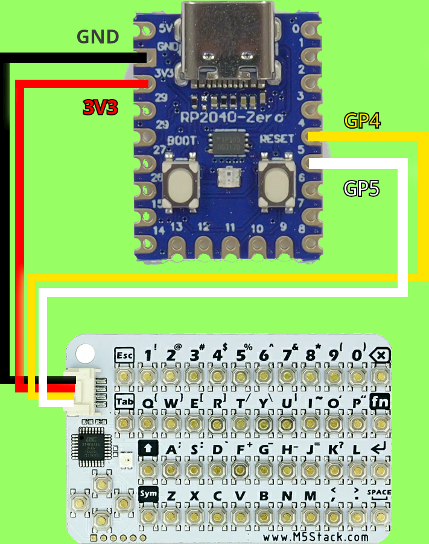

# RP2040 - CardKB-USB-Conversion

Use to convert a CardKB to USB Keyboard using a RP2040 board (Zero recomended)  compatible with linux, windows and android

# How to install it

- First solder according the conection schema 
- later download the CardKB-USB.uf2 file from release, or compile this project to obtain a .uf2 file
- Conect the RP2040 to the usb port using an USB-C cable to the computer, holding the button "boot" copy the CardKB-USB.uf2 on main directory of the RP2040, the board will reset and the keyboard will work on any compatible devvice
